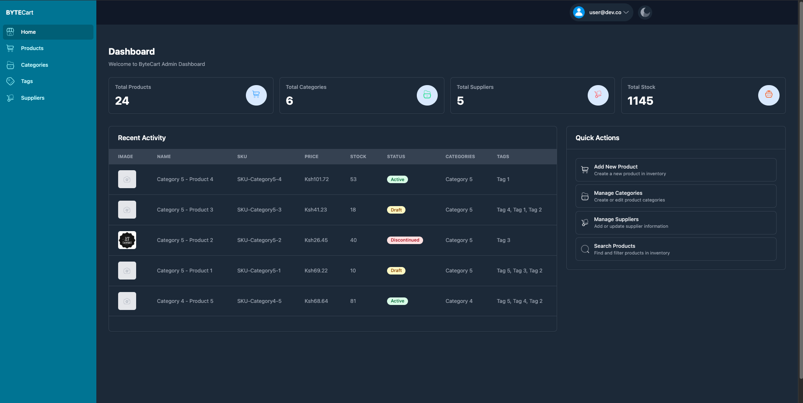
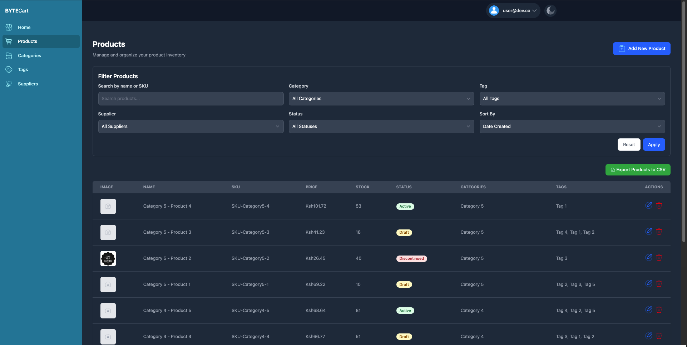
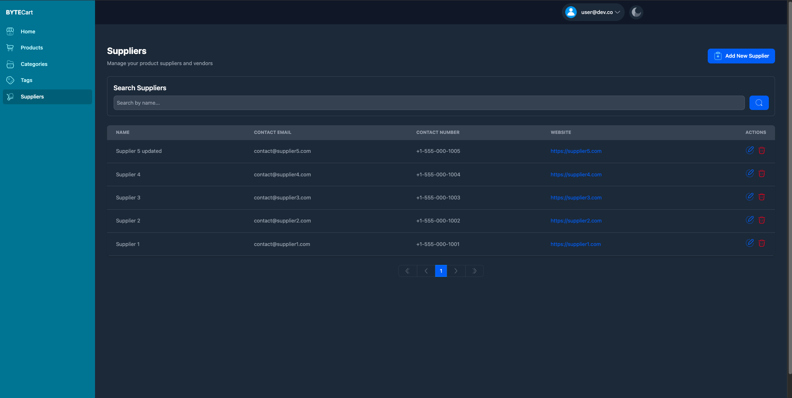
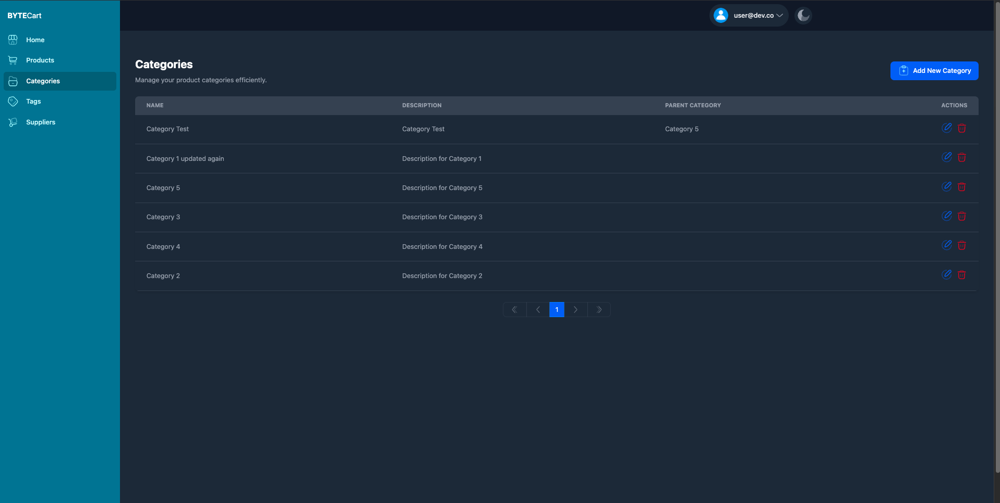

# ByteCart

ByteCart is a comprehensive e-commerce product management system built with .NET Core and Blazor, following Clean Architecture principles.

## Getting Started

### Prerequisites
- Docker
- Docker Compose

### Running the Application

1. Clone the repository
2. Navigate to the root folder
3. Run the following command:
```bash
docker compose up -d
```

This will spin up:
- The main application on `http://localhost:8080`
- PostgreSQL database on port `5432`
- Database migrations will be applied automatically and seeded with sample data

### Authentication

Use the following credentials to login:
- Email: `admin@demo.dev`
- Password: `Password123!`

## Screenshots

### Login Screen


### Dashboard


### Products Management


### Suppliers Management


### Categories Management


## Features


### Advanced Search & Filtering
- Product filtering capabilities:
  - Filter by category, tags, supplier, and status
  - Search by name or SKU
  - Sort by price, date created, or stock levels
- Bulk operations:
  - Export products to CSV
- Image uploads

## Technical Architecture

### Clean Architecture
- Follows Clean Architecture principles as outlined by Jason Taylor
- Clear separation of concerns
- Domain-driven design

### Modern Tech Stack
- Modular Blazor components for improved maintainability
- Responsive UI design for all device sizes

## UI Features
- Modern, responsive design
- Intuitive navigation
- Mobile-friendly interface
- Modular Blazor components
- Rich interactive features
