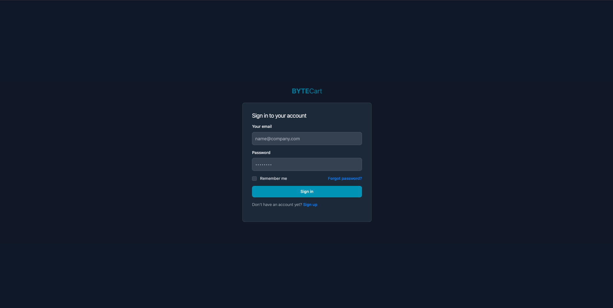

# ByteCart

ByteCart is a comprehensive e-commerce product management system built with .NET Core and Blazor, following Clean Architecture principles.

## Getting Started

### Prerequisites
- Docker
- Docker Compose

### Running the Application

1. Clone the repository
2. Navigate to the root folder
3. Run the following command:
```bash
docker compose up -d
```

This will spin up:
- The main application on `http://localhost:8080`
- PostgreSQL database on port `5432`
- Database migrations will be applied automatically and seeded with sample data

### Authentication

Use the following credentials to login:
- Email: `admin@demo.dev`
- Password: `Password123!`

## Screenshots

### Login Screen


### Dashboard


### Products Management


### Suppliers Management


### Categories Management


## Features


### Advanced Search & Filtering
- Product filtering capabilities:
  - Filter by category, tags, supplier, and status
  - Search by name or SKU
  - Sort by price, date created, or stock levels
- Bulk operations:
  - Export products to CSV
- Image uploads

## Technical Architecture

### Clean Architecture
- Follows Clean Architecture principles as outlined by Jason Taylor
- Clear separation of concerns
- Domain-driven design

### Modern Tech Stack
- Modular Blazor components for improved maintainability
- Responsive UI design for all device sizes

## Project Structure

The solution follows Clean Architecture principles with the following structure:

```
ByteCart/
├── src/
│   ├── Application/           # Application business rules
│   │   ├── Categories/       # Category-related features
│   │   ├── Common/          # Shared behaviors, interfaces
│   │   ├── Dashboard/       # Dashboard queries
│   │   ├── Products/        # Product-related features
│   │   ├── Suppliers/       # Supplier management
│   │   └── Tags/           # Tag management
│   │
│   ├── Domain/              # Enterprise business rules
│   │   ├── Common/         # Base entities and objects
│   │   ├── Constants/      # Application constants
│   │   ├── Entities/       # Domain entities
│   │   ├── Enums/         # Domain enumerations
│   │   └── ValueObjects/   # Value objects
│   │
│   ├── Infrastructure/      # External concerns
│   │   ├── Data/          # Database context and configuration
│   │   ├── Files/         # File handling
│   │   ├── Identity/      # Authentication and authorization
│   │   └── Migrations/    # Database migrations
│   │
│   └── Presentation/       # User interface
│       ├── Components/    # Blazor components
│       ├── Controllers/   # Used for Auhentication
│       ├── Services/      # UI services
│       ├── ViewModels/    # View models
│
└── tests/
```

## UI Features
- Modern, responsive design
- Intuitive navigation
- Mobile-friendly interface
- Modular Blazor components
- Rich interactive features
